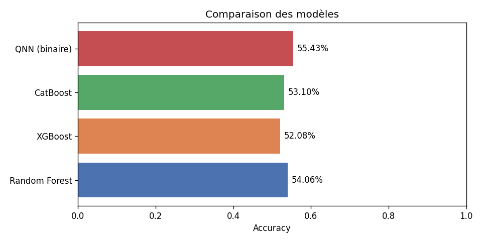
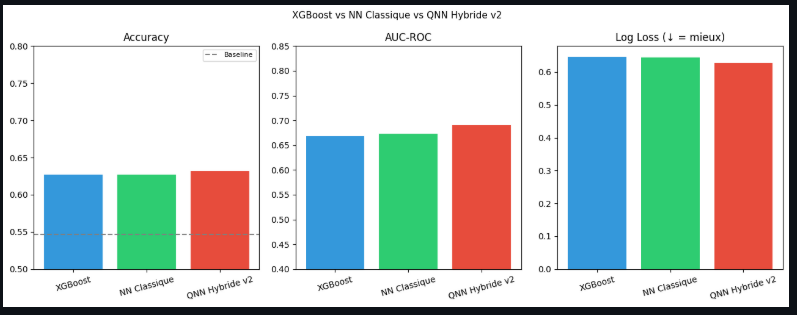
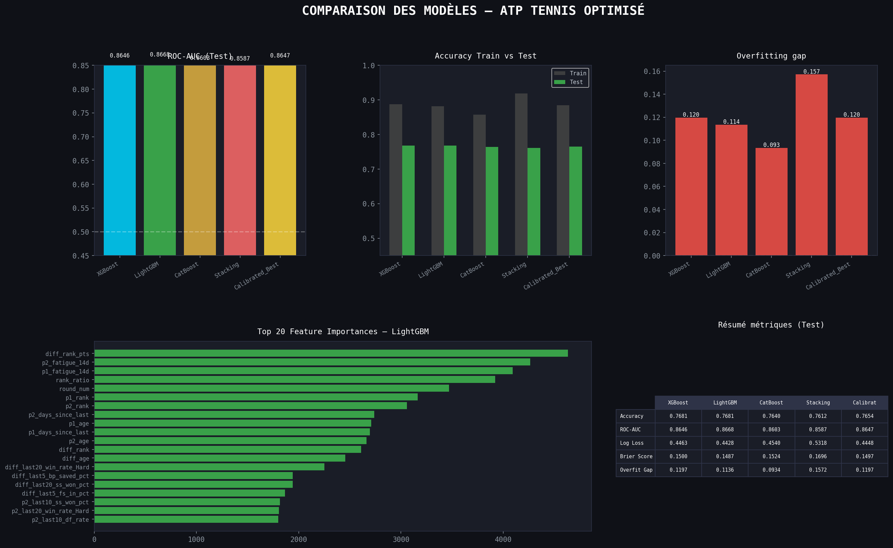

# Q-Sport : Système de Prédiction de Matchs Sportifs par Machine Learning Hybride Classique-Quantique


Template par [Riccardo Tommasini](riccardotommasini.com/) de [INSA Lyon](https://www.insa-lyon.fr/).

**Étudiants :** Carl Habsieger, Erwann Hequet, Alexis Busillet, Yliess Bellargui, Thomas Muel

---

## 📋 Table des matières

1. [Introduction](#introduction)
2. [Mise en place du projet](#mise-en-place-du-projet)
3. [Utilisation des notebooks](#utilisation-des-notebooks)
4. [Architecture et pipelines](#architecture-et-pipelines)
5. [Collecte de données et feature engineering](#collecte-de-données-et-feature-engineering)
6. [Modélisation et entraînement](#modélisation-et-entraînement)
7. [Déploiement avec Docker](#déploiement-avec-docker)
8. [Résultats et performances](#résultats-et-performances)
9. [Agent conversationnel](#agent-conversationnel)
10. [Méthodes de travail](#méthodes-de-travail)
11. [Conclusion et perspectives](#conclusion-et-perspectives)

---

## Introduction

**Q-Sport** est un système de prédiction de matchs sportifs développé dans le cadre du projet SMART à l'INSA Lyon. L'objectif est de concevoir un pipeline complet allant de la collecte de données brutes jusqu'à une interface conversationnelle permettant à un utilisateur de recevoir la prédiction d'un match en langage naturel.

### Le défi de la prédiction sportive

La prédiction sportive est un problème particulièrement difficile : les meilleurs modèles de l'industrie plafonnent autour de **65% d'accuracy**, car le sport intègre une part irréductible d'aléatoire.

### Notre approche différenciée

Q-Sport se distingue sur deux points clés :

1. **Intégration de données contextuelles en temps réel** : blessés du jour, jours de repos, matchs back-to-back, météo, stades et arbitres
2. **Utilisation d'un réseau de neurones hybride classique-quantique** (développé avec [PennyLane](https://pennylane.ai/)) dont nous évaluons la pertinence face aux approches classiques (XGBoost, Random Forest, CatBoost, LightGBM, réseaux de neurones classiques)

### Couverture sportive

Le projet couvre **trois sports** avec une architecture conçue pour être extensible :

- **Football** : 5 championnats majeurs
  - Ligue 1 (France)
  - Premier League (Angleterre)
  - Serie A (Italie)
  - La Liga (Espagne)
  - Bundesliga (Allemagne)
  - Données : 2021-2022 à 2025-2026

- **Basketball (NBA)** : Saisons 2022-2025, données actualisées pour 2025-2026

- **Tennis (ATP)** : Circuit professionnel 2020-2026 (17 163 matchs, ~1 200 joueurs)

Plusieurs modèles sont entraînés et comparés sur les **mêmes données** et les **mêmes features**, permettant une évaluation rigoureuse de l'apport du modèle quantique.

**Code source complet :** [GitHub - ThomasMuel7/QSport](https://github.com/ThomasMuel7/QSport), branche `smartpld`

---

## Mise en place du projet

### Prérequis

- **Python 3.9+** (recommandé 3.10 ou 3.11)
- **pip** ou **conda** pour la gestion des packages
- **Git** pour cloner le repository
- Optionnel : **Docker Desktop** pour le déploiement (voir [README_DOCKER.md](./README_DOCKER.md))

### Étape 1 : Cloner le repository

```bash
git clone https://github.com/ThomasMuel7/QSport.git
cd QSport
git checkout smartpld
```

### Étape 2 : Créer un environnement virtuel Python

#### Avec venv (recommandé)

```bash
# Windows
python -m venv venv
./venv/Scripts/activate

# Linux / macOS
python3 -m venv venv
source venv/bin/activate
```

#### Avec conda

```bash
conda create -n qsport python=3.10
conda activate qsport
```

### Étape 3 : Installer les dépendances

```bash
pip install -r all_requirements.txt
```

> **Note** : Le fichier `all_requirements.txt` contient toutes les dépendances nécessaires pour :
>
> - L'exploration de données (pandas, numpy, matplotlib, seaborn)
> - Le scrapping et les API (requests, beautifulsoup4, selenium)
> - Le machine learning (scikit-learn, xgboost, catboost, lightgbm)
> - Les réseaux de neurones (tensorflow, torch)
> - Le modèle quantique (pennylane, pennylane-qiskit)
> - Le backend (fastapi, uvicorn)
> - Le notebook Jupyter (jupyter, ipykernel)

L'installation peut prendre **5-15 minutes** selon votre connexion Internet.

### Étape 4 : Remplir les variables d'environnement

Créer un fichier `.env` à la racine du projet et y ajouter les clés d'API nécessaires :

```.env.example
BZZOIRO_TOKEN=ton_token
```

- **BZZOIRO_TOKEN** : [Obtenir un token sur BZZOIRO](https://sports.bzzoiro.com/register/)

---

## Utilisation des notebooks

Les notebooks interactifs permettent d'explorer les données, entraîner les modèles et valider les résultats. Ils sont organisés par sport dans le dossier `exploration/`. Nous avons décidé de laisser à disposition les notebooks de scrapping et de préparation des données pour transparence et reproductibilité, même si les données prétraitées sont déjà fournies dans `data/`. N'hésitez pas à les parcourir pour comprendre les étapes de collecte, ou à les réexécuter si vous souhaitez modifier la collecte de données.

### Structure des notebooks

```
exploration/
├── foot/
│   ├── data_scrapping.ipynb            # Scrapping multi-sources
│   ├── data_merge.ipynb                # Fusion et nettoyage
│   ├── data_preparation.ipynb          # Préparation avant fusion
│   ├── feature_engineering.ipynb       # Features complexes + visualisation + modèles ML
│   ├── feature_engineering_simple.ipynb# Features simplifiées (backup)
│   ├── whoScoredScrapper.ipynb         # Scrapping des données de WhoScored
│   └── whoScoredCleaner.ipynb          # Nettoyage des données de WhoScored
│
├── nba/
│   ├── data_scrapping_nba.ipynb        # Scrapping NBA API + ESPN
│   ├── data_preparation_nba.ipynb      # Fusion et préparation
│   ├── feature_engineering_nba.ipynb   # Rolling averages
│   ├── ml_nba.ipynb                    # Entraînement XGBoost + NN + QNN
│   └── bracket_nba_playoffs.ipynb      # Visualisation (optionnel)
│
└── tennis/
    ├── tennis_data_preparation.ipynb   # Fusion et nettoyage
    ├── tennis_data_features.ipynb      # Feature engineering (94 features)
    ├── tennis_data_entrainement.ipynb  # Optuna + 4 modèles
    ├── tennis_data_visualization.ipynb # Analyses
    ├── tennis_data_prediction.ipynb    # Prédictions
    └── tennis_prediction_final.py      # Script production
```

### Lancer un notebook

#### Avec Jupyter (interface web)

1. Lancer jupyter notebook dans le terminal à la racine du projet :

```bash
jupyter notebook
```

Le navigateur s'ouvre automatiquement sur `http://localhost:8888`. Naviguer jusqu'au notebook désiré et ouvrir.

2. Créer le kernel Jupyter à partir de l'environnement virtuel :

```bash
pip install ipykernel #normalement déjà installé
python -m ipykernel install --user --name qsport --display-name "Python (QSport)"
```

`--name qsport` : nom interne du kernel (sans espaces)
`--display-name "Python (QSport)"` : nom affiché dans Jupyter

3. Pour vérifier l'installation (le kernel doit apparaître dans la liste) :

```
jupyter kernelspec list
```

4. Sélectionner le kernel dans jupyter (en haut à droite)

5. Exécuter les cellules **une par une** avec `Shift+Enter` ou `ctrl+Enter`.

### Guide d'exécution recommandé

⚠️ **Exécutez TOUJOURS les cellules de haut en bas, une par une**, car les cellules dépendent les unes des autres.

#### Pour le Football :

1. **data_scrapping.ipynb** — Collecte multi-sources
   - FBref, TransferMarkt, StatsHub (Selenium + BeautifulSoup + undetected-chromedriver)
   - Open-Meteo API (météo historique), Nominatim (géocodage des stades), Bzzoir API (arbitres & managers)
   - Produit les fichiers CSV bruts avant préparation

2. **whoScoredScrapper.ipynb** — Récupération des données de WhoScored (statistiques détaillées par équipe)
   - Scrapping des 5 championnats majeurs (2021-2026)

3. **whoScoredCleaner.py** - Nettoyage des données WhoScored (gestion des NaN, typage, normalisation des noms)
   - Création du fichier `meteo.csv` prêt pour la fusion

4. **data_preparation.ipynb** — Nettoyage des données contextuelles
   - Traitement des données non liées aux équipes : arbitre, stade, météo, managers
   - Produit : `data/foot/dataset_final.csv`

5. **data_merge.ipynb** — Fusion des sources
   - Jointure intelligente entre WhoScored et `dataset_final`

6. **feature_engineering.ipynb** — Feature engineering + entraînement des modèles

**Défis pratiques :**

- ❌ Énormément de données manquantes incohérentes
- ❌ Noms inconsistants (accents, alias)
- ✅ Solution : Collecte manuelle par league/saison pour assurer cohérence

---

#### Pour le NBA :

1. **data_scrapping_nba.ipynb** — Collecte via NBA API + ESPN
   - 3 935 matchs sur 3 saisons (stats avancées + rosters)
   - Produit : `data/nba/nba_processed.csv`
   - ⏱️ ~10-15 min

2. **feature_engineering_nba.ipynb** — Rolling averages temporelles
   - Fenêtres 3, 5, 10, 20 matchs avec décalage pour éviter le data leakage
   - 16 features finales : contexte blessés, back-to-back, playoffs inclus
   - ⏱️ ~10 min

3. **ml_nba.ipynb** — Entraînement des modèles
   - XGBoost, CatBoost, QNN hybride (QNN = meilleures performances)
   - ⏱️ ~45 min à 1h30

4. **bracket_nba_playoffs.ipynb** — Simulation du bracket playoffs

---

#### Pour le Tennis :

1. **tennis_data_preparation.ipynb** — Préparation des données brutes
   - Fusion des 7 fichiers CSV annuels TennisMyLife
   - 17 163 matchs ATP (2020–2026) : typage, gestion des NaN
   - Produit : `data/tennis/atp_clean.csv`
   - ⏱️ ~5 min

2. **tennis_data_features.ipynb** — Feature engineering avancé
   - Rolling averages 5, 10, 20 matchs (win%, stats service)
   - H2H global et par surface, ratio classement, momentum, dominance service
   - 94 features finales — 34 326 lignes
   - ⏱️ ~15 min

3. **tennis_data_entrainement.ipynb** — Optimisation & entraînement ⭐
   - Optuna (TPE, 80 essais/modèle) sur XGBoost, LightGBM ⭐, CatBoost, QNN
   - TimeSeriesSplit 5-folds strict — Split : Train 2020-23 / Val 2024 / Test 2025-26
   - Stacking, calibration, comparaison des modèles
   - Produit : `models/tennis/` (modèles + résultats)
   - ⏱️ **2-3 heures** (Optuna intensif)

4. **tennis_data_visualization.ipynb** — Analyse & interprétation
   - Corrélations, feature importance, courbes de calibration
   - ⏱️ ~15 min

5. **tennis_data_prediction.ipynb** — Prédictions en temps réel
   - Reconstruction des features à la volée pour un nouveau match
   - ⏱️ ~5 min

---

### 💡 Conseils pratiques

- ✅ **Utilisez les CSV prétraités** pour itérer vite
- ⏸️ **Ne refaites le scraping que si nécessaire** — très long
- 💾 **Sauvegardez vos modèles** dans `models/`
- 🔄 **Recalculez les features** si vous changez la collecte
- 📊 **Validation temporelle stricte** : train passé, test futur

---

## Modélisation et entraînement

### Stratégie comparative

Tous les modèles sont entraînés sur :

- **Mêmes données**
- **Mêmes features**
- **Mêmes splits d'entraînement/test**

→ Évaluation rigoureuse de l'apport du modèle quantique

### Modèles testés

#### Football



**Sélection production :** XGBoost et CatBoost (equilibrium vitesse/perfo)

#### NBA



**Résultat majeur :** Le QNN hybride obtient les **meilleures performances** sur les trois métriques, avec Log Loss particulièrement bas = probabilités mieux calibrées.

#### Tennis



**Sélection production :** LightGBM (meilleur AUC 0.867, bonne généralisation)

### Validation temporelle stricte

**Principe :** Entraîner sur le passé, tester sur le futur (évite l'overfitting "réaliste")

#### Football

- **Train** : 2021-22 à 2024-25
- **Test** : 2025-26

#### NBA

- **Train** : 2022-23, 2023-24
- **Test** : 2024-25, 2025-26

#### Tennis

- **Train** : 2020-2023
- **Validation** : 2024
- **Test** : 2025-2026

---

## Déploiement avec Docker

Voir [README_DOCKER.md](./README_DOCKER.md) pour les instructions détaillées.

**Résumé rapide :**

```bash
# Prérequis
cp .env.example .env

# Lancer
docker compose up --build

# Accès
# Frontend : http://localhost:3000
# Backend API : http://localhost:8000
# Ollama : http://localhost:11434

# Arrêter
docker compose down
```

Le Docker Compose démarre :

- **Frontend** (React/Vue)
- **Backend** (FastAPI + modèles ML)
- **Ollama** (modèles LLM hebergé sur un google colab avec tunnel)

---

## Résultats et performances

### Football

**Baseline industrie :** 60% d'accuracy avec données propriétaires.

**Nos performances :** **50-55% d'accuracy** avec données accessibles au public (pas de licence payante, pas de cotes de paris avancées). Nous manquions aussi de temps pour faire tout ce que nous voulions et en particulier du feature engineering. De plus c'était très compliqué de récupérer des données match par match.

- ✅ **Résultat encourageant** : nous approchons les performances pros sans leurs avantages
- XGBoost et CatBoost sont quasi-équivalents (~52-53%)
- QNN légèrement meilleur (~55%) mais **trop coûteux en temps** (30 min)

### NBA

**Découverte majeure :** Le QNN hybride surpasse les modèles classiques comme prévu (alors que nous ne l'avons pas optimisé à fond !)

- **XGBoost** : 55% accuracy, Log Loss 0.647
- **CatBoost** : 54% accuracy, Log Loss 0.644
- **QNN** ⭐ : 57% accuracy, **Log Loss 0.627** ← Probabilités mieux calibrées !

L'écart sur Log Loss est **particulièrement significatif** pour notre cas d'usage (prédictions fiables).

### Tennis

**Résultats excellent :** 76.8% d'accuracy sur 2025-2026

- **Notre modèle (LightGBM)** : 76.8% accuracy, **AUC 0.867**
- **Baseline naïve** (toujours prédire meilleur classé) : 73.0% accuracy

**Gain net : +3.8 points**, démontrant que nos features ajoutent un signal réel au-delà du classement seul.

**Validation Masters 1000 Madrid 2026 :**

- Notre modèle : **65.3%** vs baseline **64.2%** (+1.1 point)
- Performance sur phases finales : **100%** correct (demi-finales + finale)
- Écart plus modeste qu'en test expliqué par correction d'un data leakage détecté

**Conclusion :** Notre modèle excelle particulièrement dans les matchs au sommet où la forme récente prime sur le classement seul (avantage que la baseline ne possède pas).

---

## Agent conversationnel

### Architecture

L'application Q-Sport intègre un **agent LLM conversationnel** basé sur :

- **Framework :** LangChain
- **Modèle :** LLAMA3.1:8B (via Ollama)
- **Backend :** FastAPI (Python)
- **Frontend :** Interface web React/Vue

### Fonctionnalités

L'utilisateur peut prédire un match en **langage naturel** :

```
User: "Qui va gagner entre Manchester United et Liverpool demain ?"
→ Agent analyse la requête
→ Appelle predict_football(ManUnited, Liverpool)
→ Retourne la probabilité avec explication
```

### Tools disponibles

L'agent a accès à trois functions principales :

1. **predict_football** : Prédiction matchs football (5 championnats)
2. **predict_nba** : Prédiction matchs NBA
3. **predict_tennis** : Prédiction matchs tennis (joueurs ATP)

Chaque tool :

- Récupère les données contextuelles (blessés, météo, etc.)
- Envoie les données aux modèles entraînés
- Retourne probabilité, écart prédit, cotes

### Intégration des blessés

Pour la NBA, l'agent récupère **automatiquement** les blessés via ESPN API et pénalise le Net Rating des équipes affectées.

### Déploiement

L'agent tourne dans Docker (voir [README_DOCKER.md](./README_DOCKER.md)) en conteneur à part du frontend/backend, permettant :

- ✅ Scalabilité indépendante
- ✅ Isolation des dépendances
- ✅ Mise à jour simplifiée

---

## Méthodes de travail

### Organisation Git

**Branche principale :** `smartpld`

**Branches spécialisées :**

- `nba` : Pipeline basketball
- `feature/chatbot` : Agent LLM
- `scrap_who_scored` : Scrapping whoScored
- `new_par_foot` : Nouvelles analyses foot
- `tennis` : Pipeline tennis

**Workflow :**

1. Chaque membre crée une branche depuis `smartpld`
2. Travail en parallèle sans conflits
3. Merge vers `smartpld` une fois finalisé
4. ✅ Une fois toutes les branches mergées : simple "branchement" en appelant les fonctions Python

### Interface d'intégration

Dès le début du projet, accord sur une **interface simple et uniforme** :

```python
# Pour chaque sport, une fonction unique
result_foot = predict_football(team1, team2)
result_nba = predict_nba(team1, team2)
result_tennis = predict_tennis(player1, player2)
```

→ **Décision clé :** Cet accord a permis le parallélisme complet et un assemblage trivial en production.

### Répartition des rôles

- **Yliess Bellargui** : Backend FastAPI + Agent LLM
- **Thomas Muel & Erwann Hequet** : Pipeline football complet
- **Carl Habsieger** : Pipeline NBA + Modélisation ML + QNN
- **Alexis Busillet** : Pipeline tennis + Optimisation Optuna + Visualisation

### Problèmes techniques et solutions

#### Football

- ❌ **Problème :** Énormément de données manquantes incohérentes
- ✅ **Solution :** Collecte complète et manuel, assurance de cohérence

#### NBA

- ❌ **Problème :** NBA.com retourne erreurs 403 depuis Docker (User-Agent insuffisant)
- ✅ **Solution :** Basculer vers API publique ESPN (pas de blocage)

#### Tennis

- ❌ **Problème :** Data leakage détecté en cours de projet
- ✅ **Solution :** Recalcul strict des features avec décalage temporel

---

## Conclusion et perspectives

### Validation scientifique ✅

Ce projet **valide empiriquement** que l'hybridation classique-quantique apporte un **gain mesurable** sur des données sportives réelles.

**Résultat particulièrement significatif :** Le QNN tourne sur **simulateur CPU**, sans avantage matériel quantique réel. Sur hardware quantique réel, les gains seraient encore plus importants.

### Améliorations court terme

1. **Données enrichies**
   Récupérer plus de données et passer plus de temps à les traiter

2. **Pipeline robustesse**
   Fine-tune le modèle LLM pour avoir moins d'hallucinations. Ajouter une meilleure couche pour la sécurité et améliorer l'agent.

### Perspectives moyen terme

**Déploiement sur hardware quantique réel (IBM Quantum)**

- Temps entraînement QNN : **38 min → quelques secondes** sur processeur dédié et accès à plus de features car plus de qubits

### Perspectives long terme

**Q-Sport multi-sport généraliste**

Architecture **modulaire et extensible** conçue pour accueillir :

- 🏈 Rugby
- 🏏 Cricket
- 🎮 E-sport
- ⚾ Baseball

**Modularité garantie :**

```
Chaque sport = collecte → feature engineering → modélisation → agent LLM
Zéro refonte majeure du pipeline
```

---

## Étendre le projet

### Modifier le comportement de l'agent

Le comportement de l'agent est entièrement contrôlé par le `SYSTEM_PROMPT` dans `agent.py`. C'est le premier levier à modifier pour changer la façon dont l'agent interprète les requêtes ou formate ses réponses.

```python
# agent.py
SYSTEM_PROMPT = """You are QSport, an expert sports prediction assistant.
...
"""
```

**Exemples de modifications utiles :**

Changer la langue de réponse par défaut :

```python
# Remplacer dans SYSTEM_PROMPT
"Be concise and structured."
# par
"Always respond in French, be concise and structured."
```

Ajouter un nouveau sport reconnu :

```python
# Dans la section STEP 1: IDENTIFICATION, ajouter
"- For rugby: use full team names (ex: 'Stade Toulousain', 'Racing 92')."

# Dans STEP 2: TOOL CALL, ajouter
"- predict_rugby → for ANY rugby match, no matter what."

# Dans EXAMPLES, ajouter
"- 'Toulouse vs Racing' → call predict_rugby('Stade Toulousain vs Racing 92')"
```

Modifier le niveau de verbosité des réponses :

```python
# Remplacer
"Be concise and structured."
# par
"Always include a short explanation of the key factors driving the prediction."
```

### Changer le modèle LLM

Le modèle est configuré exclusivement via `.env` — aucune modification de code nécessaire :

```env
OLLAMA_MODEL=mistral        # Plus rapide, moins précis
OLLAMA_MODEL=llama3.1:8b    # Meilleur équilibre (défaut)
OLLAMA_MODEL=llama2:13b     # Plus précis, trop lourd pour T4
```

Pour les paramètres fins du modèle (température, etc.), modifier `agent.py` :

```python
# agent.py
llm = ChatOllama(
    model=os.getenv("OLLAMA_MODEL", "mistral-nemo"),
    base_url=os.getenv("OLLAMA_HOST"),
    temperature=0.1,   # 0.0 = déterministe, 1.0 = créatif
)
```

### Ajouter un nouveau tool

Un tool est une fonction Python décorée avec `@tool` que l'agent peut appeler. Voici comment en ajouter un de A à Z.

#### Étape 1 — Créer la logique métier

Créer un nouveau fichier (ex: `rugby_prediction.py`) avec une fonction exposant le résultat :

```python
# rugby_prediction.py
def predict_rugby(team1: str, team2: str) -> dict:
    # Charger le modèle, construire les features, inférer...
    return {
        "winner": team1,
        "p_home_win": 0.62,
        "p_away_win": 0.38,
    }
```

#### Étape 2 — Déclarer le tool dans tools.py

```python
# tools.py
from langchain.tools import tool

try:
    from rugby_prediction import predict_rugby as predire_rugby
except Exception as e:
    predire_rugby = None
    print(f"[tools] Rugby predictor non disponible: {e}")

@tool
def predict_rugby(teams: str) -> str:
    """Predit le resultat d'un match de rugby Top 14 ou Champions Cup.
    Format: 'EQUIPE1 vs EQUIPE2' (ex: 'Stade Toulousain vs Racing 92')."""
    code
```

> **Important :** La docstring du `@tool` est ce que le LLM lit pour décider quand appeler ce tool. Elle doit être claire, courte, et mentionner le format d'entrée attendu.

#### Étape 3 — Enregistrer le tool dans l'agent

```python
# agent.py
from tools import predict_nba, predict_foot, predict_tennis, predict_rugby  # Ajouter ici

tools = [predict_nba, predict_foot, predict_tennis, predict_rugby]  # Ajouter ici
```

#### Étape 4 — Mettre à jour le prompt système

```python
# agent.py — dans SYSTEM_PROMPT, section STEP 2
"- predict_rugby → for ANY rugby match, no matter what."

# Section EXAMPLES
"- 'Toulouse vs Racing' → call predict_rugby('Stade Toulousain vs Racing 92')"
```

#### Étape 5 — Rebuild le backend

```bash
docker compose up -d --build backend
```

---

### Impact global

Q-Sport démontre que même **sans données propriétaires**, une approche rigoureuse en :

- 📊 Collecte multi-source
- 🔧 Feature engineering temporel
- 🤖 Comparaison modèles exhaustive
- 🔗 Hybridation classique-quantique

...produit des résultats **compétitifs avec l'industrie** et ouvre des perspectives quantiques concrètes.

---

## 📝 Licence

Ce projet est distribué sous la licence Apache 2.0. Voir [LICENSE](./LICENSE) pour plus de détails.

**Dernière mise à jour :** 06 Mai 2026  
**Version :** 1.0
